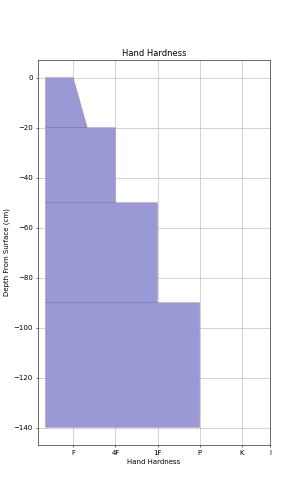

=====
Usage
=====
Form a configuration file using the the sections you want and save this to `config.ini`
e.g. ::
    [hand_hardness]
    filename: hand_hardness.txt

    [output]
    filename: figure.png

Where the `hand_hardness.txt` file has::

    140-120 = F,F+
    120-90 = 4F
    90-50 = 1F
    50-0 = p

Then run snowplot on your config file in the commandline::

    snowplot config.ini

This will produce the following image:

